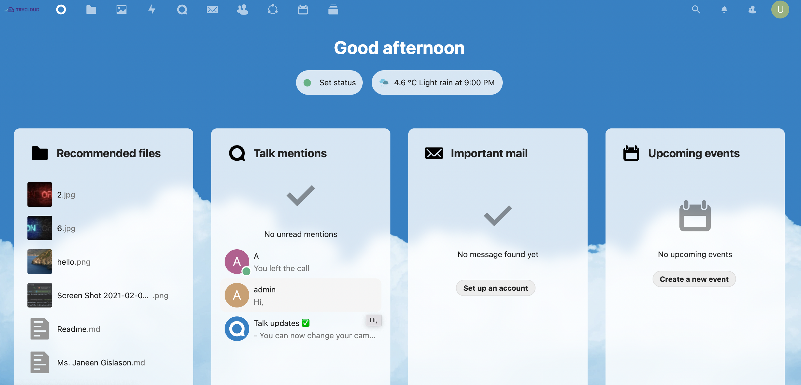

# TryCloud App

##About project:

###This project is a cloud storage web-based app

####Features are:

* Safe and secure file synchronization / real-time working on sharing files through cloud server
* User contact management   
* Communication  - text / audio / video chat  
* Keyword search file & All types of files like: doc/ppt/xls/csv/psd/ai
* Customizable dashboards and wallboards
* Calendar & event creation  
* Customizable workflows

  
### BDD Cucumber Framework

###Tools:
* Java
* Selenium WebDriver
* Maven
* Cucumber-JUnit
* Design patterns - POM, Singleton
* Github
* IntelleiJ IDEA

### Responsibilities QA Team:

* F1 - Regina
* F2 - Regina
* F3 - Ada
* F4 - Tariq
* F5 - Ebru
* F6 - Ahmet
* F7 - Korkmaz
* F8 - Tatiana
* F9 - Nick
* F10 - Mumin
* F11 - Rana
* F12 - Tyler
* F13 - Gunay
* F14 - Jeyhun

## Questions &  Contributing

 |

 |

 |

!

 |

